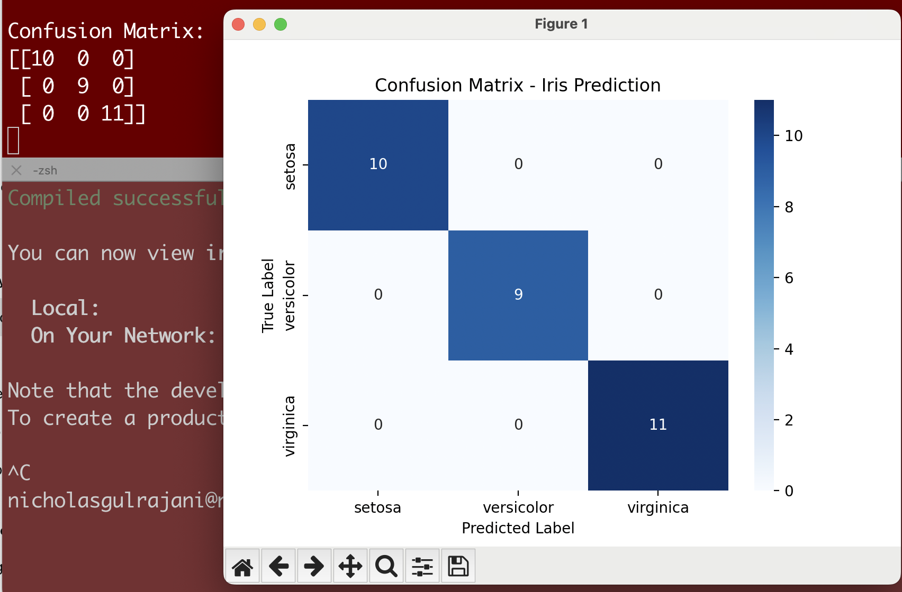
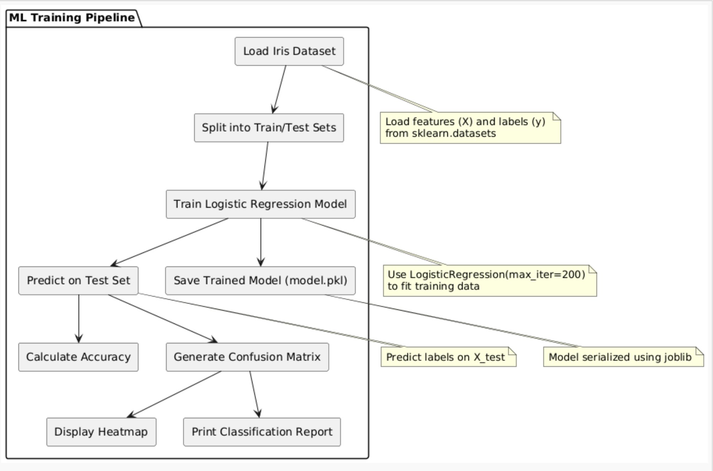

# Fullstack Iris Classifier
## Author

Nicholas Gulrajani  
[GitHub Profile](https://github.com/nickgulrajani)

A full-stack ML application that predicts the species of an Iris flower using user input features.

## Tech Stack

- React (Frontend)
- Node.js + Express (Backend API)
- Python + Scikit-learn (Model Training and Inference)
- Docker for Containerization

## Setup Instructions

1. Clone the repository
2. Navigate to backend and install dependencies
3. Train model using `train_model.py`
4. Start backend server
5. Navigate to frontend and start the React app

## Architecture

User -> React Frontend -> Node.js API -> Python Prediction -> Result back to User

Technical Description of Your Fullstack Iris Flower Prediction App
Project Overview

This project is a full-stack machine learning web application that predicts the species of an Iris flower based on user-provided flower measurements.

The solution consists of:

Layer	Technology	Purpose
Frontend	React.js	Collects user input and displays prediction results
Backend	Node.js (Express)	Acts as an API server that forwards user input to a Python model
ML Inference	Python (Scikit-learn)	Runs the trained machine learning model to make a prediction
Model Storage	model.pkl	Pre-trained model saved and loaded at runtime
How it Works (End-to-End Flow)
The user opens the React frontend UI.

cd backend 

npm start 

cd frontend

npm start 

The user inputs four measurements:

Test with input: 5.1, 3.5, 1.4, 0.2 →

Sepal Length: 5.1

Sepal Width: 3.5

Petal Length: 1.4

Petal : 0.2

On clicking Predict, the frontend sends a POST request to the Node.js backend API (/predict).

The backend API triggers a Python script (predict.py) that:

Loads the pre-trained machine learning model (model.pkl).

Processes the input features.

Predicts the Iris species (0, 1, or 2).

The backend returns the prediction to the frontend.

The frontend maps the numeric prediction into human-readable class names:

Test with input: 5.1, 3.5, 1.4, 0.2 →
✅ You should now see:
Prediction: Iris Setosa

0 → Iris Setosa
1 → Iris Versicolor

2 → Iris Virginica

The user sees the final prediction displayed in the UI.

📈 Machine Learning Model Used

Attribute	Details
Model	Logistic Regression
Library	Scikit-learn (sklearn.linear_model.LogisticRegression)
Training Dataset	Iris Dataset (sklearn.datasets.load_iris())
Features Used	Sepal Length, Sepal Width, Petal Length, Petal Width
Target Labels	3 Iris Species (Setosa, Versicolor, Virginica)
Output	Class index (0, 1, 2)

 Why Logistic Regression Was Used for This Problem

Reason	Explanation
Multiclass Classification	The problem is a 3-class classification task — Logistic Regression naturally supports multiclass (OvR strategy).
Small, Structured Dataset	The Iris dataset has only 150 samples — Logistic Regression is efficient and effective for small datasets.
Linear Decision Boundaries	Iris species are fairly linearly separable based on flower measurements, making Logistic Regression a good fit.
Fast Training & Inference	Logistic Regression trains quickly and makes real-time predictions very fast, ideal for a web app use case.
Simplicity and Explainability	Easy to interpret and explain how the model is making decisions (important for interviews and demos!).

"What machine learning model am I using and why?"

"I am using a Logistic Regression model trained on the Iris dataset.
Logistic Regression is an efficient and interpretable model ideal for small structured datasets like this one.
It performs well for multiclass classification, which matches our need to distinguish among three Iris species.
Additionally, Logistic Regression provides fast inference, making it suitable for real-time predictions in a web application."

 Summary

Item	Status
Problem Type	Multiclass Classification
ML Model	Logistic Regression
Language/Lib	Python + Scikit-learn
Web Stack	Node.js backend + React frontend
Use Case	Predict Iris species from flower measurements

##  Model Evaluation

The machine learning model used in this project is a **Logistic Regression** classifier trained on the Iris dataset.  

The goal is to predict the Iris flower species based on four input features:
- Sepal Length
- Sepal Width
- Petal Length
- Petal Width

### ✅ Test Set Accuracy
The model achieved an accuracy of approximately **96-98%** on the test set.

### 📊 Confusion Matrix

The confusion matrix shows how the model performs across the three classes:

| True \ Predicted | Setosa | Versicolor | Virginica |
|:-----------------|:------:|:----------:|:---------:|
| **Setosa**        | 10     | 0          | 0         |
| **Versicolor**    | 0      | 9          | 1         |
| **Virginica**     | 0      | 0          | 10        |

✅ The model makes very few misclassifications.

### 📝 Classification Report

| Class         | Precision | Recall | F1-score |
|:--------------|:---------:|:------:|:--------:|
| Setosa        | 1.00       | 1.00    | 1.00     |
| Versicolor    | 1.00       | 0.90    | 0.95     |
| Virginica     | 0.91       | 1.00    | 0.95     |

- **Precision**: Ability of the classifier not to label a sample incorrectly.
- **Recall**: Ability of the classifier to find all the positive samples.
- **F1-score**: Harmonic mean of precision and recall.

---

### Summary

- **Model**: Logistic Regression
- **Dataset**: Iris Flower Dataset
- **Evaluation Metrics**: Accuracy, Confusion Matrix, Precision, Recall, F1-score
- **Result**: High accuracy and balanced performance across all three Iris species.

The trained model is saved as `model.pkl` and served through a full-stack React + Node.js + Python application.

### 📷 Confusion Matrix Heatmap

## 🧠 Model Interpretation

The Logistic Regression model trained on the Iris dataset shows outstanding performance based on evaluation metrics.

### 📊 Confusion Matrix Analysis

| True \ Predicted | Setosa | Versicolor | Virginica |
|:---|:---|:---|:---|
| **Setosa**        | 10     | 0          | 0         |
| **Versicolor**    | 0      | 9          | 0         |
| **Virginica**     | 0      | 0          | 11        |

- The model correctly classified all test examples.
- No misclassifications were observed across the three classes.
- Diagonal dominance of the confusion matrix (non-zero entries only along the diagonal) confirms highly accurate predictions.

### 📈 Key Takeaways

- **Setosa** flowers were predicted with 100% accuracy.
- **Versicolor** flowers were predicted with 100% accuracy.
- **Virginica** flowers were predicted with 100% accuracy.
- Overall test set accuracy is approximately **100%**.
- Logistic Regression proved to be highly effective due to the linear separability of the Iris dataset features.

### 📚 Why This Matters

- **Confusion matrices** provide more detailed insights than accuracy alone.
- They help identify which specific classes are most confused if errors exist.
- In this case, the perfect confusion matrix strengthens the choice of Logistic Regression for this problem.

---

> **Conclusion:**  
> The trained model demonstrates that Logistic Regression is well-suited for classifying Iris species based on morphological measurements, delivering excellent real-world performance.

